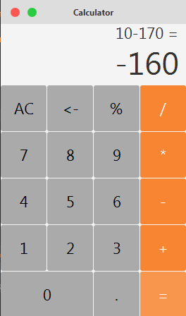

# CalculatorFX 📱
Calculator UI made it using JavaFX.

## Screenshot

## Used library
* JFoenix.

## Follow me
<a href="https://www.facebook.com/ZegaiBlog">Facebook</a> | <a href="https://www.youtube.com/HouariZegai">Youtube</a> | <a href="https://www.twitter.com/HouariZegai">Twitter</a> | <a href="https://www.instagram.com/HouariZegai">Instagram</a>

.سبحَانَكَ اللَّهُمَّ وَبِحَمْدِكَ، أَشْهَدُ أَنْ لا إِلهَ إِلأَ انْتَ أَسْتَغْفِرُكَ وَأَتْوبُ إِلَيْكَ
